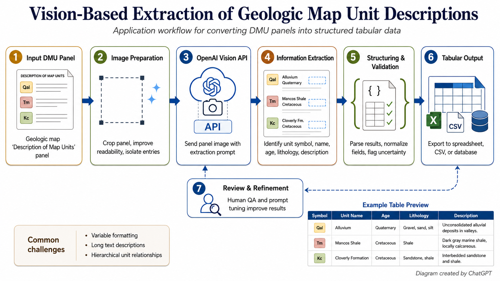

# geo-map-exp-extractor

Template-driven visual table extraction from images of scanned geologic map explanations (specifically the Description of Map Units, or "DMU").

`geo-map-exp-extractor` turns visually complex explanation panels (DMUs) into reviewable, structured tables for use in GIS, geology, and publication workflows. It is designed for processing and interpreting material such as stratigraphic columns, formation explanations, engineering-property tables, water-production descriptions, footnotes, and other scanned cartographic text blocks where layout and visual relationships carry meaning.

## Context

The National Geologic Map Database (NGMDB) is engaged in a long-term effort to compile the master DMU table, drawing content from all of Nation's geologic maps whether they are in GIS format (specifically the GeMS schema) or in paper or PDF format.  This master DMU table follows the GeMS schema for the "DescriptionOfMapUnits" table, and is integrated with all other components of the NGMDB's database (see components at https://ngmdb.usgs.gov/), and results from several years of prototyping.  Functionality for content search is forthcoming, after NGMDB staff judge there is sufficient content in this table to warrant deployment.

The NGMDB is a Congressionally mandated national archive, managed by the U.S. Geological Survey and built in collaboration with the Nation's State geological surveys (represented by the Association of American State Geologists, or AASG).  Over three decades, the USGS and AASG have built the NGMDB into a truly authoritative system.

As with all other components of the NGMDB, full population of this master DMU table would not possible without the close collaboration with State geological survey colleagues.  This git site provides a community-driven set of evolving technical specifications for populating the master DMU table with content derived from OCRing of scanned, paper geologic maps.  We hope you will engage with us in this process.  For general questions about this process, please contact the NGMDB chief, Dave Soller ([drsoller@usgs.gov](mailto:drsoller@usgs.gov)).  For questions about the code at this site, please contact Andrew Wunderlich ([andrew.wunderlich@tn.gov](mailto:andrew.wunderlich@tn.gov)).

## Why use a vision-capable AI model for this workflow?

Conventional OCR is useful for recognizing characters as they are organized on a traditional "book page", but a geologic explanation panel is rarely just a block of continuous text. It may contain columns of variable width, wrapped descriptions, formation symbols, headings that apply to several rows, irregular spacing, rotated text, standalone notes, and text whose context depends on its visual position. A vision-capable model can consider the image and the extraction instructions together, which makes it better suited to interpreting these relationships and returning information in tabular form.

This project does not use the vision-capable model as an unchecked transcription shortcut. It surrounds the model call with a controlled workflow:

- A reusable prompt defines the general extraction behavior.
- A YAML profile defines the task, fields, field order, preservation rules, normalization choices, and special instructions for a particular table type.
- Optional profile notes add reviewed, task-specific guidance without burying that guidance in Python code.
- A dynamically generated JSON Schema requires a predictable response shape that can be validated before export.
- The selected image, prompt, schema, profile, model settings, hashes, usage, and outputs are preserved in a run folder for review and auditing.
- A correction workflow keeps the original extraction, reviewed output, comments, and feedback separate so changes remain traceable.

The goal is therefore not merely to "read the text." It is to apply the same documented extraction specification to similar source images, preserve important geologic wording and symbols, and produce CSV and JSON data that can move into downstream GIS or publication work with less manual restructuring.

## Conceptual overview of GUI workflow
This application uses a controlled, repeatable workflow to convert visually complex Description of Map Units (DMU) panels and similar geologic map explanation graphics into structured, reviewable data. Rather than treating the source as ordinary OCR text, the workflow preserves the visual relationships between unit symbols, headings, descriptions, and other elements and combines those relationships with a defined extraction specification.

This workflow was designed to address these common challenges when parsing a DMU: variable formatting between different maps and publishers (and vintages); long, wrapped, or irregularly positioned/rotated descriptions; hierarchical relationships between groups, formations, members, and other map units; small or degraded text in historical scans; and layouts in which the meaning of text depends on its spatial relationship to other elements.



*Diagram of geo-map-exp-extractor workflow*

### Extraction workflow via the GUI
1. *Input DMU panel* - The user selects an image of a scanned geologic map explanation or DMU panel together with an extraction profile. The profile defines the type of information being extracted, the output fields and their order, text-preservation rules, and any task-specific instructions. This allows the same application to be used for different kinds of geologic explanation tables without hard coding each format into the program. 
2. *Image preparation* - The application prepares the source image for submission to the model, including format conversion or resizing when required. The goal is to preserve as much readable map text and layout information as possible while creating an image suitable for API processing. For unusually tall or dense panels, an optional segmented mode can divide the source into overlapping sections so that small text remains readable. 
3. *OpenAI Vision API* - The prepared image is sent to a vision-capable OpenAI model together with a reusable extraction prompt, the selected profile, optional reviewed profile notes, and a dynamically generated JSON Schema. Model, reasoning, image-detail, and other request settings are controlled by the application so that the extraction process can be documented and reproduced. A dry-run option allows the complete request to be prepared and inspected without making an API call. 
4. *Information extraction* - The vision model interprets both the text and visual organization of the source image. Depending on the selected profile, this may include identifying map-unit symbols, unit names, ages, lithologies, descriptions, thicknesses, headings, notes, or other geologic information. This is especially important for DMU panels because the meaning of text often depends on its position, grouping, indentation, or relationship to neighboring entries rather than on the words alone. 
5. *Structuring and validation* - Model output is constrained to the field structure defined by the profile and JSON Schema. The application validates the returned structure and maintains the specified field order before creating downstream files. The request configuration, processed image, hashes, prompt, schema, profile, model settings, usage information, and other metadata are also preserved with the run, making an extraction inspectable and auditable rather than an isolated AI response. 
6. *Tabular output* - Successful extractions convert the information that previously existed only as visually arranged map graphics into machine-readable records while retaining the wording and organization required by the extraction profile. The resulting tables are written to structured JSON and CSV files that can be reviewed via the built-in spreadsheet-like editor in the GUI. Corrected data can then be incorporated into GIS databases, geologic data-management systems, spreadsheets, or publication workflows. 
7. *Review and refinement* - Human review remains an explicit part of the workflow. The GUI allows reviewers to edit extracted cells, add or remove rows, change row order, assign review statuses, and record comments or run-level notes. Reviewed results are saved separately from the original model output so that corrections remain traceable. Corrected examples can also be promoted as reference data for regression testing and deliberate improvement of profiles and extraction instructions. This is a key point: the application does not silently re-train itself or modify user prompts based on corrections made to the output; improvements must remain intentional and reviewable. Step 7 is a human feedback loop: the reviewer learns from the result and can improve the profile, notes, or extraction instructions. This application and workflow are designed to deliberately preserve critical human oversight.


## Using a web interface versus this API workflow

Uploading an image to the ChatGPT web interface can be useful for exploration, testing an idea, discussing an unusual panel, or performing a one-time extraction. It is conversational by design: the user supplies instructions in a chat, reviews the response, and may refine the request through follow-up messages. That flexibility is valuable, but it can be difficult to reproduce the exact prompt, settings, output format/schema, and review history across many images or users.

This software uses the OpenAI API to make the extraction process programmatic and inspectable. For each run, it can submit the same prompt template, profile, schema, model settings, and image-processing rules; validate the returned structure; preserve artifacts; reuse an identical cached request; and export the result in a known field order. The GUI provides a convenient desktop interface to this API workflow, while the CLI makes the same workflow available for scripted or confirmed batch use.

"Repeatable" describes the controlled process, *not a promise that a generative model will always return byte-for-byte identical text*. Model outputs are probabilistic and can vary, scans can be ambiguous, and structured output still requires validation and human review. Profiles, notes, fixed settings, caching, and saved corrections reduce much of the *avoidable* variation and make differences easier to identify, explain, and improve deliberately.

The project is *not* a bulk OCR utility and does not auto-learn by silently rewriting prompts or profiles. Improvements remain in the hands of the operator--intentional and reviewable.

## API key and billing

This software was designed using the OpenAI API, thus a key is required for live image extraction because the application sends the prepared image, prompt, and schema to the OpenAI API. Dry runs and local review operations such as editing, saving, loading, and promoting existing results do not require an API call.

### Getting an API key

1. Sign in to an OpenAI account, or create one, at the [OpenAI API Keys page](https://platform.openai.com/api-keys). This page requires an account and login.
2. Select **Create new secret key** and configure the key for the appropriate API project and permissions.
3. Copy the new secret immediately and store it securely. OpenAI displays the full secret only when it is created; if it is lost, create a replacement key.
4. Configure API billing or credits for the API account if required. API usage and billing are separate from ChatGPT subscriptions, so a paid ChatGPT plan does not by itself include API usage.
5. Set the key as `OPENAI_API_KEY` in your shell environment or place it in a repo-local `.env` file as shown below. The GUI's `Set API key...` control can also set a temporary override for the current session.

IMPORTANT: Treat an API key like a password: do not share it, paste it into issues or logs, or commit it to source control. Do not store a real key in `.env.example`; that file is a template only. The application never logs or writes the key when processing images.

Example `.env`:

```env
OPENAI_API_KEY=your_real_key_here
```

## Windows — ready-to-run deployment

For ordinary Windows use, download the **Windows deployment ZIP** from the
[GitHub Releases page](https://github.com/alwunder/geo-map-exp-extractor/releases). Do not use
GitHub's automatic **Source code (zip)** archive as the deployment package; it does not contain the
ready-to-run deployment layer.

The Windows deployment does not require administrator rights, PowerShell, Git, pip, a preinstalled
Python or uv, or manual virtual-environment setup.

1. Download the Windows deployment ZIP from Releases.
2. Extract it to a folder you can write to, such as a folder under Documents or Downloads. Do not
   run the application from inside the ZIP.
3. Double-click **Run Geo Map Exp Extractor.bat**.
4. Allow the first launch to prepare the private Python runtime and application environment for
   your Windows account. Subsequent launches are much faster.
5. In the application, use **Set API key...** to provide an OpenAI API key for the current session,
   then use the application normally. The session key is application configuration, not part of
   deployment setup, and the GUI can open without it.

The deployment ZIP includes its verified bootstrap executable. First setup still requires
permitted HTTPS access to download managed Python and the locked Python packages. It uses the
Windows certificate store, including organizational trust roots configured on the computer. If
network or security policy blocks a download, do not bypass that policy; collect the deployment
logs and contact the appropriate support team.

The extracted deployment also includes:

- **Diagnose Geo Map Exp Extractor.bat**, which reports deployment, runtime, write-access, and
  configuration-presence information without displaying an API key;
- **Repair Geo Map Exp Extractor Environment.bat**, which rebuilds only this user's application
  environment while preserving application source and project data.

Deployment logs are stored under:

```text
%LOCALAPPDATA%\PythonDeploymentBuilder\apps\geo-map-exp-extractor\logs\
```

Deployment state is stored under the adjacent `state` directory. When reporting a deployment
problem, include the relevant Diagnose output and recent deployment logs, but never send an API key
or `.env` file.

Completed extraction project/run folders are self-contained. They may be copied or moved to a new
writable location and reopened with **Load Project**; the selected folder becomes the authoritative
location for its image, extracted rows, notes/feedback, and other project-local files.

## Dev installation

Use Python 3.11+.

```powershell
python -m venv .venv
.\.venv\Scripts\Activate.ps1
python -m pip install -e ".[dev]"
```

The activation command above is for PowerShell. In Command Prompt, use
`.venv\Scripts\activate.bat`; on macOS or Linux, use `source .venv/bin/activate`.

Installing the package creates two console commands:

- `geo-map-exp-extractor`: the command-line extraction interface.
- `geo-image-extract-gui`: the graphical extraction and review workbench.

These are installed command names, not filenames in the repository. They map to
`geo_map_exp_extractor.cli:app` and `geo_map_exp_extractor.gui:main`, respectively,
as defined in `pyproject.toml`.

## CLI usage

Single image (default safe workflow):

```powershell
geo-map-exp-extractor single `
  --image input/water_properties.png `
  --profile profiles/water_production.yml `
  --out-dir outputs
```

Dry run (no API call):

```powershell
geo-map-exp-extractor single `
  --image input/water_properties.png `
  --profile profiles/water_production.yml `
  --out-dir outputs `
  --dry-run
```

Batch mode (explicit confirmation required unless `--yes`):

```powershell
geo-map-exp-extractor batch `
  --image-dir input/ `
  --pattern "*.png" `
  --profile profiles/water_production.yml `
  --out-dir outputs
```

## GUI usage

Launch:

```powershell
geo-image-extract-gui
```

The GUI is a single-image extraction and review workbench. It shows a charge warning and asks for confirmation before a live API call. Reviewing, editing, saving, loading, and promoting results are local operations and do not call the API.

### Input and project controls

- `Image`: the scanned explanation image to extract. Use `Browse...` to select it; the selected image appears in the preview pane.
- `Profile`: the YAML profile that defines the extraction task, output columns and column order, text-preservation rules, and special instructions. Selecting a profile also loads its saved model and processing defaults.
- `Output`: the parent directory in which the app creates a timestamped, auditable run folder.
- `Use profile notes`: appends the optional `profiles/<profile>.notes.md` file to the extraction prompt. Enable this only when those reviewed notes are relevant to the selected profile.
- `Set API key...`: sets an API key override for the current GUI session. `Use .env key` returns to the key loaded from `OPENAI_API_KEY` or the repo-local `.env` file. The key is not written into run artifacts.
- `Open output folder`: opens the active run folder, or the selected output directory before a run exists.
- `Help`: opens this README inside the application.

### API call options

- `Model`: chooses the OpenAI API model used for extraction. `gpt-5.6-sol` is the current default. The full list is `gpt-5.4-mini`, `gpt-5.4`, `gpt-5.5`, `gpt-5.5-pro`, `gpt-5.6-sol`, and experimental `chat-latest`.
- `Reasoning effort`: controls how much reasoning work the model may perform. `none` or `low` can reduce latency and token use; `medium` is the default; `high` and `xhigh` are intended for difficult scans or layouts and may take longer and cost more. Support can vary by model.
- `Image detail`: controls how the API processes the image. `high` is the recommended default for small geologic text and complex panels; `low` can be faster and cheaper but may lose fine detail; `auto` lets the API choose.
- `Dry run (no API call)`: prepares the image, prompt, schema, hashes, and run artifacts without sending a request or incurring an extraction charge. Use it to verify configuration before a live run.
- `Force re-run`: bypasses an existing matching cache entry and makes a fresh API request. Leave it off to reuse cached output when the image and request settings have not changed.
- `Segmented mode (higher cost)`: divides a tall image into overlapping vertical sections and extracts each section separately. It can improve readability on unusually long or dense panels, but it may make multiple API calls, cost more, and produce rows that need duplicate review near overlaps.
- `Apply maximum output token limit`: sends the adjacent value as `max_output_tokens`, which covers both reasoning and final output tokens. The default is `12000`. Increase it if a large table is truncated; disable the checkbox to omit the cap. Larger limits permit, but do not guarantee, greater token usage.
- `Run extraction`: validates the selections, requests confirmation for a live call, then runs extraction. An identical request may be served from cache unless `Force re-run` is enabled.

Model, reasoning effort, image detail, token-limit settings, profile content, and the processed image all affect the request. Changing them can produce a different cache fingerprint and result.

### Image preview

- `Zoom -` / `Zoom +`: decrease or increase the current magnification in steps.
- `100%`: display one image pixel per screen pixel.
- `Zoom Width`: fit the image to the preview pane's width, useful for reading a tall panel from top to bottom.
- `Zoom Extents`: fit the entire image inside the current preview pane.
- Left-click and drag the image to pan. The scrollbars provide horizontal and vertical navigation when the image is larger than the pane.

The divider between the image and results panes can be dragged to give either side more room.

### Results table and review controls

The table columns come directly from the selected profile and remain in profile order.

- Edit a cell directly in the table. In the fallback table view, double-clicking a cell opens a multiline editor; `OK` applies the edit and `Cancel` discards it.
- `Add row`: inserts a blank row for content the model missed.
- `Delete row`: removes the selected row from the corrected result.
- `Move up` / `Move down`: changes the selected row's position in the output.
- `Auto-fit rows`: adjusts displayed row heights to make wrapped cell content easier to read.
- `Reset widths`: restores automatically calculated column widths after manual resizing.
- `Status`: records the review decision for the selected row. Choose the appropriate review state before applying it.
- `Comment`: stores an optional reviewer note for the selected row.
- `Apply`: saves the selected row's status and comment in the current in-memory project. These review details are written to `feedback.jsonl` when the project is saved.
- `Notes`: stores run-level review notes that are written to `notes.md` and included in the feedback log when saved.

Cell changes and row operations are tracked as review feedback. They do not modify the original `extracted.json` or `extracted.csv` files.

### Saving, reopening, clearing, and promoting reviewed work

- `Save project`: writes the current reviewed table to `corrected.json` and `corrected.csv`, saves `notes.md`, and writes review events and final review records to `feedback.jsonl`. This is a local operation with no API call.
- `Clear project`: returns the workbench to a clean, demo-ready state by clearing the active image, profile, run, table, notes, review metadata, and preview. It resets extraction options to their application defaults but retains the session API key and output directory.
- `Load project`: opens an existing run folder containing `manifest.json` and loads `corrected.json` when available, otherwise `extracted.json`. It also restores the source image, notes, and available row review metadata.
- `Promote corrected`: copies previously saved corrected JSON and CSV files into `examples/gold/<profile_id>/` for future regression testing and profile improvement. Save the project before promoting it.

If the current table, review metadata, or notes contain unsaved changes, the app offers `Yes` (save), `No` (do not save), and `Cancel` choices before clearing the project, loading another project, starting a replacement extraction, or exiting. Clearing is disabled while an extraction is running, and exiting during a running extraction requires separate confirmation.

The status bar at the bottom reports the current operation, completion state, cache use, save state, and errors.

## Request safety and efficiency

Before API execution, the app:

1. Loads and validates profile.
2. Builds final prompt and strict JSON schema.
3. Prepares image (conversion/resizing only when needed).
4. Computes request fingerprint using:
   - processed image hash
   - selected profile and field order
   - final prompt hash
   - model name
   - image detail setting
   - schema version

If the same fingerprint already exists in cache, the app reuses cached data unless rerun is forced.

## Image preparation policy

- Accepts common source formats.
- Converts unsupported formats locally before API submission.
- Converts TIFF/PDF pages to API-friendly images (first page/frame).
- Resizes only when necessary to avoid oversized payloads while preserving readability.
- Uses `high` detail by default for map/explanation panels.

## Run folders and audit trail

Each run creates a timestamped folder under `outputs/` with:

```text
source_image.<ext>
processed_api_image.<ext>
profile.yml
prompt.txt
schema.json
raw_response.json            # omitted for dry run
extracted.json               # omitted for dry run
extracted.csv                # omitted for dry run
corrected.json               # written after review save
corrected.csv                # written after review save
feedback.jsonl
manifest.json
notes.md
segments/                    # when segmented mode is enabled
```

`manifest.json` includes run metadata, hashes, model/detail settings, request fingerprint, fresh-vs-cache mode, usage tokens (when available), estimated cost (when pricing is configured), and output paths.
It records `model`, `reasoning_effort`, `image_detail`, and `max_output_tokens` for every run.

## Model selection guidance

| Use case                                     | Model                     | Reasoning effort | Image detail |
|----------------------------------------------|---------------------------|------------------|--------------|
| Cheap quick test                             | `gpt-5.4-mini`            | low or medium    | high         |
| General extraction                           | `gpt-5.4` or `gpt-5.5`    | medium           | high         |
| Default production extraction                | `gpt-5.6-sol`             | medium           | high         |
| Difficult panel / poor scan / complex layout | `gpt-5.6-sol` or `gpt-5.5` | high             | high         |
| Very difficult audit/review pass             | `gpt-5.5-pro`             | high or xhigh    | high         |

`gpt-5.6-sol` is available in both the GUI model selector and the CLI (`--model gpt-5.6-sol`) and is the current application default. Profiles may specify a different default model, and the GUI applies that setting when a profile is selected.

`chat-latest` is available only as an experimental option; production and repeatable audit runs should prefer fixed model names. Model availability, reasoning support, and pricing depend on the API account and current OpenAI service configuration.

## Cost awareness

Model pricing is manually configurable in:

- `src/geo_map_exp_extractor/pricing.py`

Post-run cost estimation is based on actual usage fields returned by the API (`input_tokens`, `output_tokens`, `cached_tokens` when present). Pre-run image token numbers are rough estimates only. See [Pricing | OpenAI API](https://developers.openai.com/api/docs/pricing) for the latest OpenAI API pricing.

## Review/correction workflow

- Manual edits do not call the API.
- `Save corrected` writes `corrected.csv`, `corrected.json`, and `feedback.jsonl`.
- `feedback.jsonl` records row index, field name, old value, new value, status, and optional comment.
- `Promote corrected` copies corrected outputs to `examples/gold/<profile_id>/` for future testing.

## Profile improvement loop

- Profiles stay in `profiles/*.yml`.
- Optional notes file support: `profiles/<profile>.notes.md`.
- Notes are included in prompts only when enabled (`--include-profile-notes` or GUI checkbox).
- Corrections are stored for human review; prompts/profiles are updated intentionally, not automatically.

## Segmentation policy

- Segmentation is not the default.
- If enabled programmatically, segments are created with overlap and each call is logged separately.
- Segmented mode can increase cost because it makes multiple API calls.

## Recommended workflow

1. Dry run.
2. Single extraction.
3. Review/edit.
4. Save corrections.
5. Promote good examples to `examples/gold/`.
6. Only then run confirmed batch processing.

## Testing

Run tests:

```bash
python -m pytest
```

Unit tests cover hashing/caching behavior, dry-run no-call behavior, manifest content, cost estimation, corrected output writing, and feedback JSONL writing with mocked extraction runners.
